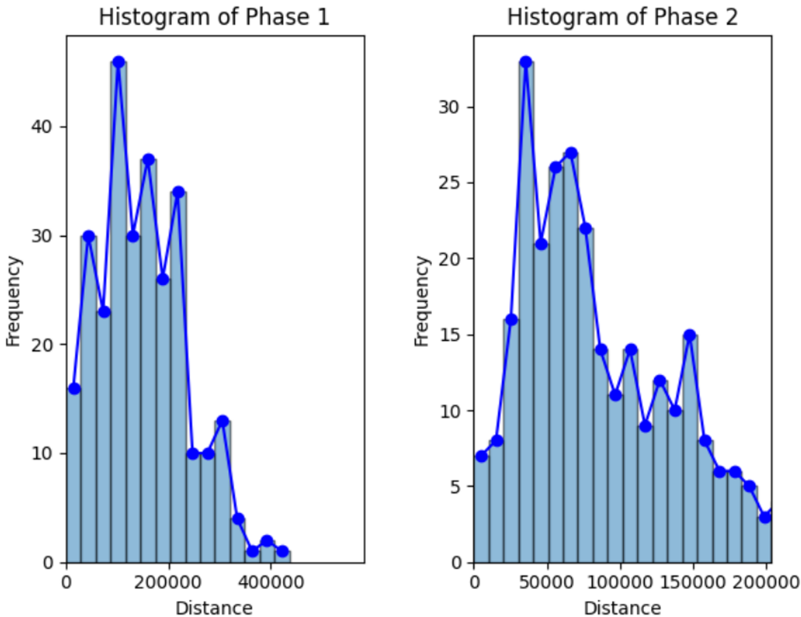
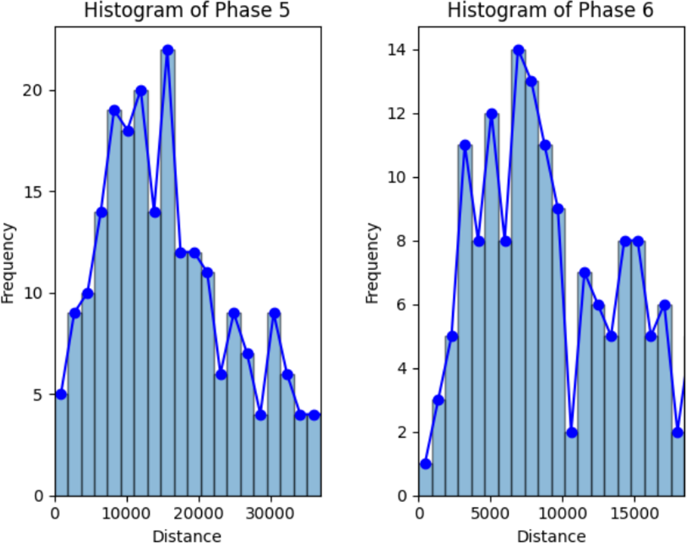

# Analysis(MapName_Mirama)


그림1. whitezone의 중심


그림2. alive_user들의 기하학적 중심점


그림3. hitezone의 중심과 alive_user들의 중심의 거리

```bash
주제 : 배틀그라운드: 생존자 위치와 화이트존 생성의 통계적 상관성 분석
주제선정이유 : 배틀그라운드를 자주 플레이하는 유저로서, 게임의 승패에 큰 영향을 미치는 자기장(세이프티존)의 위치가 무작위로 생성되는지, 
							 아니면 생존자들의 위치를 기반으로 생성되는지에 대해 궁금증이 생겼습니다. 이러한 의문을 해결하기 위해 데이터 분석을 통해 자기장 생성 규칙을 검증하고, 
							 이를 위한 데이터 수집 및 처리 파이프라인을 구축하는 것을 주제로 선정하게 되었습니다.
	
1. 상관분석 수행을 위해 상관계수 사용
 - 피어슨
	- 선형 상관계수 측정
	- 데이터가 정규 분포를 따를때 사용
	- 두 변수 간의 선형관계 측정
 - 스피어만
	- 데이터 분포에 대한 가정이 필요없음
	- 데이터가 정규분포를 따르지 않아도 유용함
2. 상관 계수 선택을 위한 데이터의 정규성 검정 : 데이터의 정규분포 여부확인
 - 시각화 : 히스토그램, QQ플롯, BOX 플롯
 - 통계적 방법 : 샤피로-윌크 테스트, 콜모그라브-스미노프 테스트
 - H0(귀무가설): 살아있는 유저들의 위치와 자기장 중심의 위치는 무관하다. 즉, 자기장은 무작위로 잡힌다.
 - H1(대립가설): 살아있는 유저들의 위치가 자기장 중심의 위치에 영향을 미친다. 즉, 자기장은 살아있는 유저들의 위치를 고려하여 잡힌다.
	- P-value : 값이 작을수록 귀무가설 기각 근거 강해짐
	- alpha(유의수준) : 귀무가설을 기각하는 기준이 되는 값 0.05 또는 0.01
```

```bash
import requests
import matplotlib.pyplot as plt
from scipy.stats import shapiro, spearmanr, probplot

# 가설 설명
print("""
- H0(귀무가설): 살아있는 유저들의 위치와 자기장 중심의 위치는 무관하다. 즉, 자기장은 무작위로 잡힌다.
- H1(대립가설): 살아있는 유저들의 위치가 자기장 중심의 위치에 영향을 미친다. 즉, 자기장은 살아있는 유저들의 위치를 고려하여 잡힌다.
""")

# GET 요청을 보낼 기본 URL
base_url = 'http://192.168.0.79:5000'
endpoints = "/whitezoneAnalysis/phases"
header = {
    "Accept": "application/json"
}

# GET 요청 보내기
get_response = requests.get(url=base_url + endpoints, headers=header)

# 응답 상태 코드 확인
print('Status Code:', get_response.status_code)

# 응답 데이터 출력
if get_response.status_code == 200:
    data = get_response.json()
else:
    print('Failed to retrieve data')
    data = {}

# 거리 리스트 초기화
distance_list = []
phase_coordinates = []

for i in range(len(data)):
    phase_list = []
    coordinates_list = []
    phase_key = f"Phase{i+1}"
    if phase_key in data:
        for j in range(len(data[phase_key])):
            x1 = data[phase_key][j]["user_geometry_center_x"]
            x2 = data[phase_key][j]["white_zone_center_x"]
            y1 = data[phase_key][j]["user_geometry_center_y"]
            y2 = data[phase_key][j]["white_zone_center_y"]
            distance = ((x1 - x2) ** 2 + (y1 - y2) ** 2) ** 0.5
            phase_list.append(distance)
            coordinates_list.append((x1, y1, x2, y2))
        distance_list.append(phase_list)  # 반복문 밖으로 이동
        phase_coordinates.append(coordinates_list)

# 각 페이즈별 x축 범위 설정
x_limits = [581999, 203699, 112034, 67220, 36971, 18485, 9242, 5000]

# 각 페이즈별로 샤피로-윌크 검정 수행 및 히스토그램 시각화
num_phases = len(distance_list)
fig, axes = plt.subplots(2, num_phases, figsize=(25, 10))

for i in range(num_phases):
    specific_phase = distance_list[i]
    
    # 샤피로-윌크 검정
    stat, p_value = shapiro(specific_phase)
    print(f'Phase {i+1} - Shapiro-Wilk Test: Statistics={stat}, p-value={p_value}')
    if p_value > 0.05:
        print(f'Phase {i+1} 데이터는 정규 분포를 따릅니다 (귀무가설 기각 실패)')
    else:
        print(f'Phase {i+1} 데이터는 정규 분포를 따르지 않습니다 (귀무가설 기각)')

    # 히스토그램 그리기
    bin_width = x_limits[i] / 20  # 구간을 20개로 나누기
    bins = range(0, int(max(specific_phase) + bin_width), int(bin_width))
    
    counts, bins, _ = axes[0, i].hist(specific_phase, bins=bins, edgecolor='black', alpha=0.5)
    bin_centers = 0.5 * (bins[1:] + bins[:-1])
    axes[0, i].plot(bin_centers, counts, linestyle='-', marker='o', color='blue')
    axes[0, i].set_title(f'Histogram of Phase {i+1}')
    axes[0, i].set_xlabel('Distance')
    axes[0, i].set_ylabel('Frequency')
    axes[0, i].set_xlim(0, x_limits[i])

    # QQ 플롯 생성
    probplot(specific_phase, dist="norm", plot=axes[1, i])
    axes[1, i].set_title(f'QQ Plot of Phase {i+1}')
    axes[1, i].set_xlabel('Theoretical Quantiles')
    axes[1, i].set_ylabel('Sample Quantiles')

plt.tight_layout()
plt.show()

# 스피어만 상관분석(정규분포를 따르지 않아서 피어슨 대신 스피어만분석 사용) 
for i in range(len(distance_list)):
    specific_phase = distance_list[i]
    distances = list(range(len(specific_phase)))
    
    # 거리 데이터에 대한 스피어만 상관분석
    corr, p_value = spearmanr(distances, specific_phase)
    print(f'Phase {i+1} - 스피어만 상관분석: 상관계수={corr}, p-value={p_value}')

```







- 그림3 의 히스토그램


### QQ plot 해석

- **전체적인 형태**: 모든 페이즈에서 점들이 대각선에서 벗어나 있는 것을 볼 수 있습니다. 특히 양 끝 부분에서 더 많이 벗어나 있습니다. 이는 데이터가 정규 분포를 따르지 않는다는 것을 의미합니다.
- **끝부분의 패턴**: 각 페이즈에서 끝부분의 점들이 대각선에서 멀리 벗어나 있는 것을 볼 수 있습니다. 이는 데이터의 꼬리가 정규 분포의 꼬리보다 두껍다는 것을 나타냅니다. 즉, 극단적인 값들이 더 많이 존재합니다.

### 스피로-월크(정규분포 확인) → 정규분포 따르지 않기에 피어스만 상관분석


### 피어스만 상관분석 결과


## 피어스만 상관분석 해석

### Phase 1

- **상관계수**: -0.018 (매우 약한 음의 상관관계)
- **p-value**: 0.760 (유의미하지 않음)
- **해석**: 유저 위치와 자기장 중심 위치 간에 상관관계가 거의 없으며, 통계적으로 유의미하지 않음.

### Phase 2

- **상관계수**: -0.033 (매우 약한 음의 상관관계)
- **p-value**: 0.574 (유의미하지 않음)
- **해석**: 유저 위치와 자기장 중심 위치 간에 상관관계가 거의 없으며, 통계적으로 유의미하지 않음.

### Phase 3

- **상관계수**: 0.038 (매우 약한 양의 상관관계)
- **p-value**: 0.524 (유의미하지 않음)
- **해석**: 유저 위치와 자기장 중심 위치 간에 상관관계가 거의 없으며, 통계적으로 유의미하지 않음.

### Phase 4

- **상관계수**: 0.037 (매우 약한 양의 상관관계)
- **p-value**: 0.535 (유의미하지 않음)
- **해석**: 유저 위치와 자기장 중심 위치 간에 상관관계가 거의 없으며, 통계적으로 유의미하지 않음.

### Phase 5

- **상관계수**: 0.030 (매우 약한 양의 상관관계)
- **p-value**: 0.626 (유의미하지 않음)
- **해석**: 유저 위치와 자기장 중심 위치 간에 상관관계가 거의 없으며, 통계적으로 유의미하지 않음.

### Phase 6

- **상관계수**: 0.073 (매우 약한 양의 상관관계)
- **p-value**: 0.250 (유의미하지 않음)
- **해석**: 유저 위치와 자기장 중심 위치 간에 상관관계가 거의 없으며, 통계적으로 유의미하지 않음.

### Phase 7

- **상관계수**: 0.064 (매우 약한 양의 상관관계)
- **p-value**: 0.364 (유의미하지 않음)
- **해석**: 유저 위치와 자기장 중심 위치 간에 상관관계가 거의 없으며, 통계적으로 유의미하지 않음.

### Phase 8

- **상관계수**: 0.083 (매우 약한 양의 상관관계)
- **p-value**: 0.387 (유의미하지 않음)
- **해석**: 유저 위치와 자기장 중심 위치 간에 상관관계가 거의 없으며, 통계적으로 유의미하지 않음.

### 결론

모든 페이즈에서 p-value가 0.05 이상이므로, 유저 위치와 자기장 중심 위치 간의 상관관계는 통계적으로 유의미하지 않다고 볼 수 있습니다. 따라서, 귀무가설(H0): "살아있는 유저들의 위치와 자기장 중심의 위치는 무관하다"를 기각할 수 없습니다.

즉, 데이터에 따르면 살아있는 유저들의 위치가 자기장 중심의 위치에 영향을 미친다는 증거가 없습니다. 자기장은 무작위로 설정된다고 볼 수 있습니다.